# Google Meet Helper


## Features:
  * Automatically join a meeting.
  * Auto mute microphone and camera.
  * Skiping annoying alerts.
  * Automatic account and language switching.
  * Full screen mode (shows only the presenter screen and nothing else).
  * Volume adjustment.
  * Picture in Picture.

## Installation:
### Chrome:
  1. Download latest **[Release](https://github.com/SuperZombi/Google-Meet-Helper/releases)**.
  2. Extract the archive to an installation location.
  3. ```⋮``` > "Additional tools" > "Extensions".
  4. Turn on "Developer Mode".
  5. Press "Load unpacked extension".
  6. Select the path to the unpacked folder.

### Tampermonkey:
  1. Install **[Tampermonkey](https://www.tampermonkey.net/)**.
  2. Install **[Script](https://raw.githubusercontent.com/SuperZombi/Google-Meet-Helper/main/meet.user.js)**.


## Overview:
<details>
  <summary></summary>
  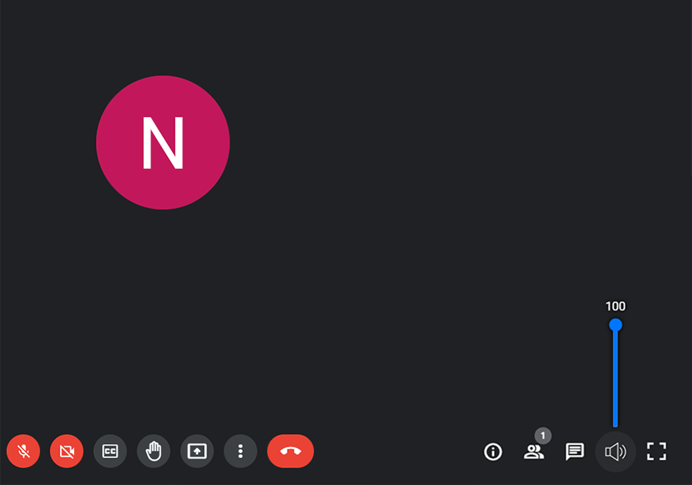
  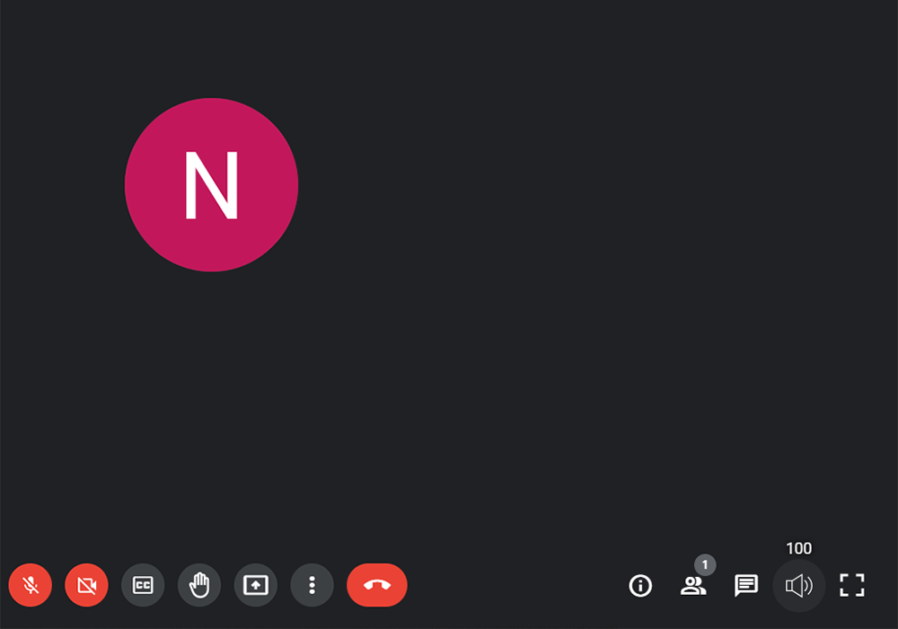
</details>

## Detailed Instructions
<details>
  <summary></summary>
    
   ### Install
   <details>
   <summary></summary>
   
   #### Chrome
   <details>
   <summary></summary>
     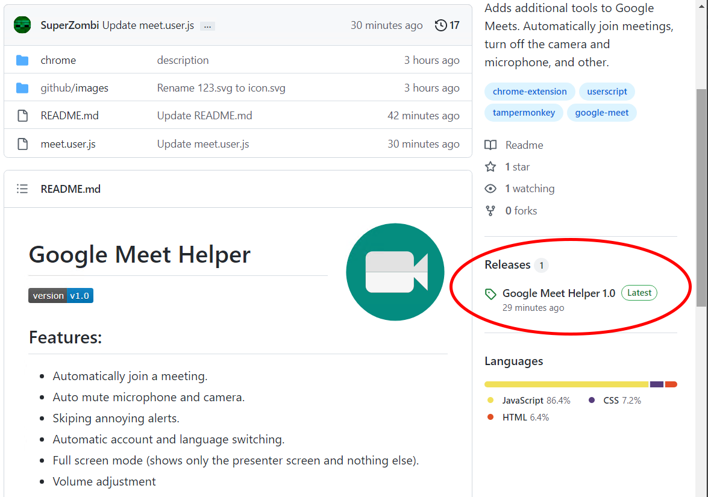
     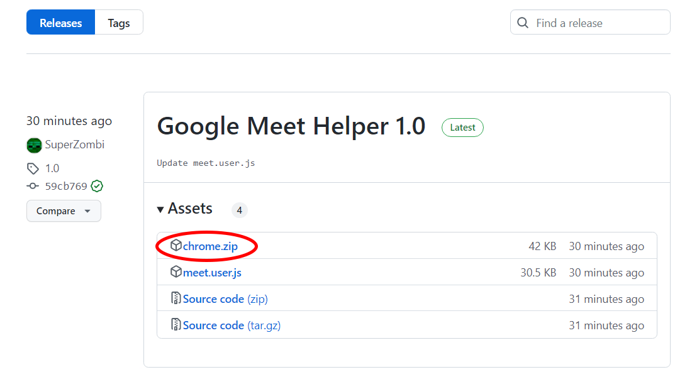
     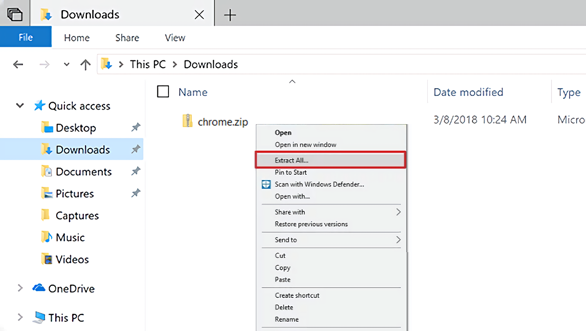
     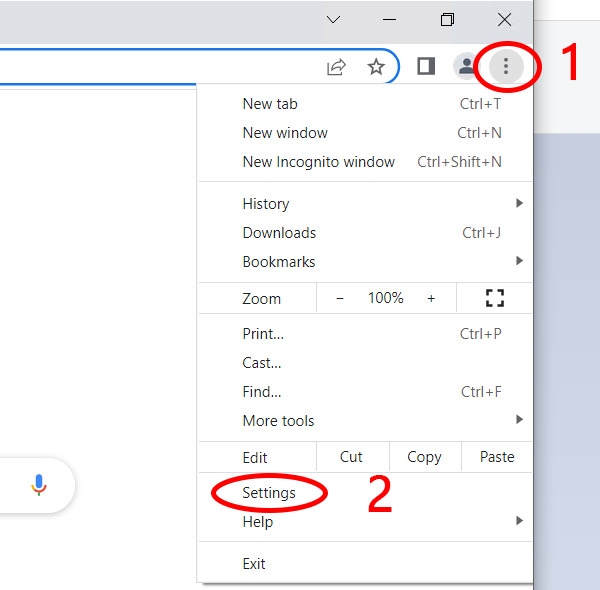
     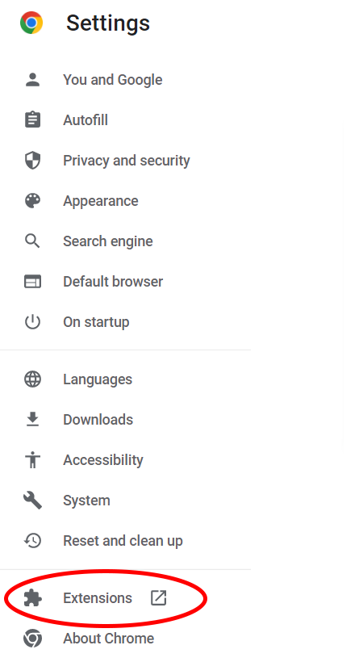
     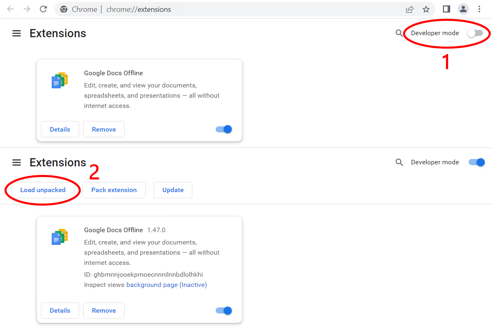
     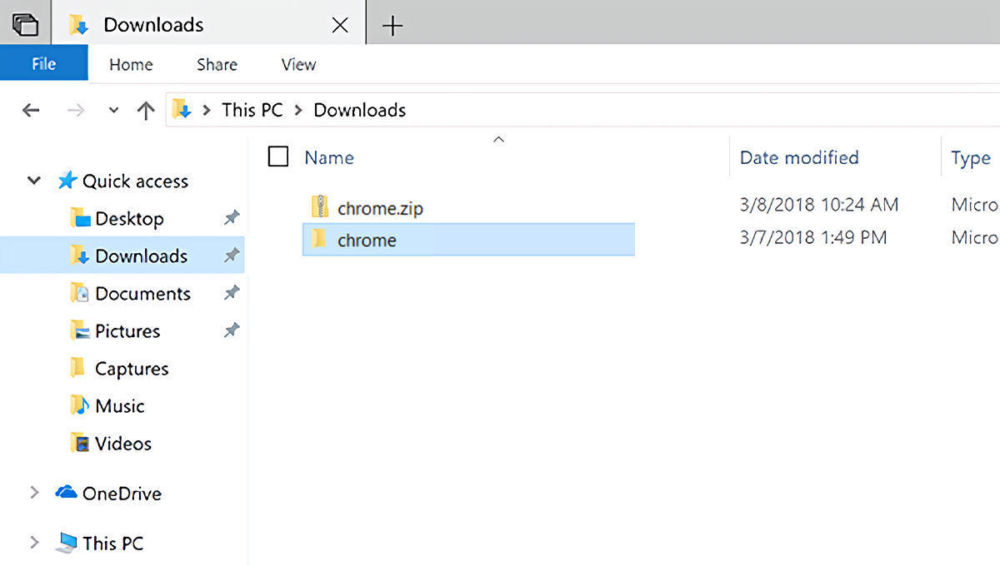
     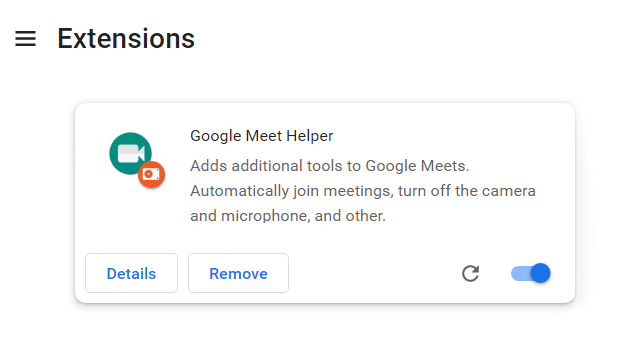
   </details>
        
   #### Tampermonkey
   <details>
   <summary></summary>
     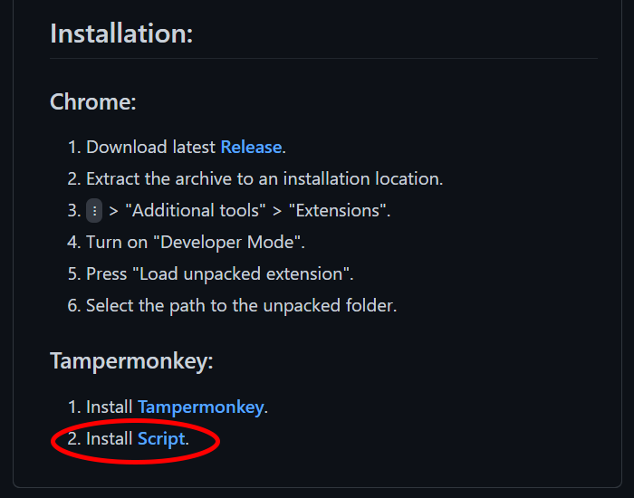
     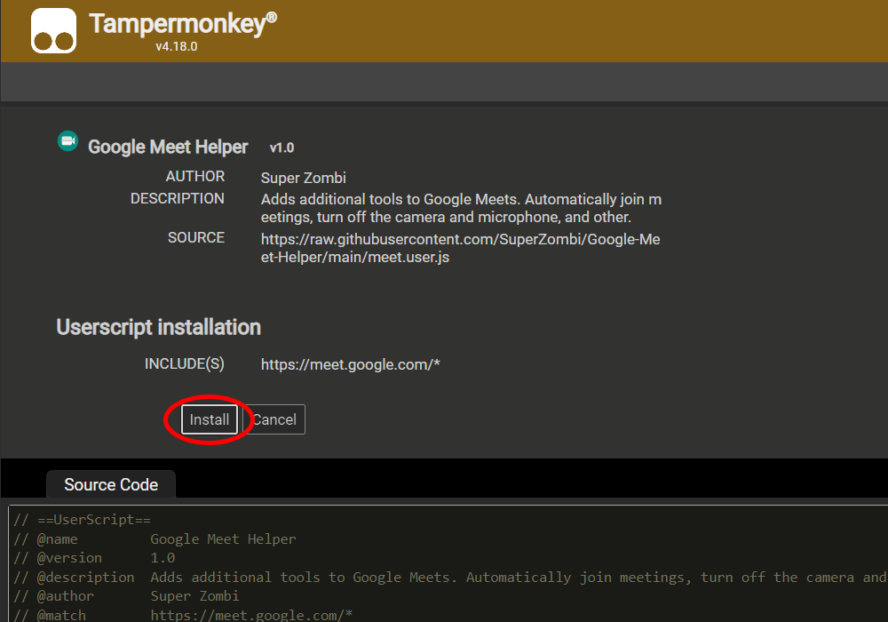
   </details>
  </details>
  
  <hr>
  
   ### Open Settings
   <details>
   <summary></summary>
   
   #### Chrome
   <details>
   <summary></summary>
     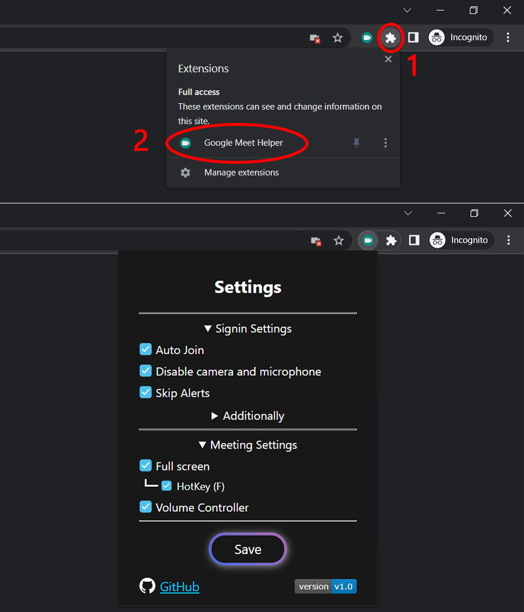
   </details>
        
   #### Tampermonkey
   <details>
   <summary></summary>
     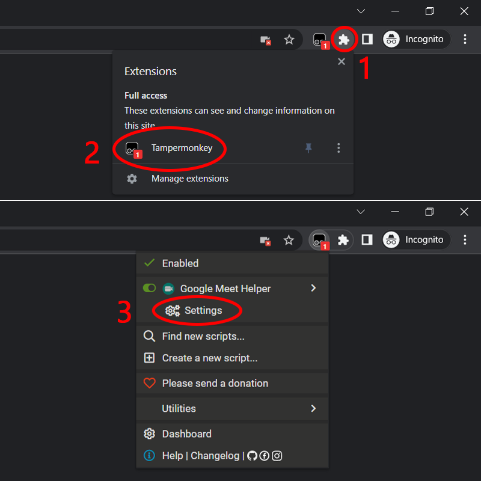
     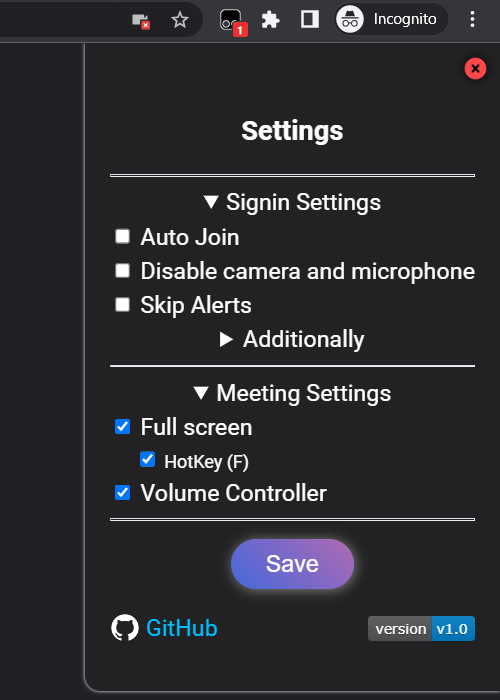
   </details>
  </details>  
</details>


## List of changes:

  ### 1.2.1:
   * Update to latest Google Meet changes

  ### 1.2:
   * Fixed bug with Volume bar not displaying on click

  ### 1.1:
   * Fixed fullscreen hotkey conflict with chat
   * Added Picture in Picture feature
   * Bug fixes

<hr>

#### <a href="https://www.donationalerts.com/r/super_zombi">Support the project</a> (But now it's better to email me and I'll send you the details)
